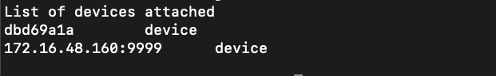

# Android 无线调试手机（WiFi 调试）

在Android开发调试过程中，时常拿起手机但是有时候手机连着充电线就非常不方便。无线调试就非常爽。

Android无线调试的原理：adb利用TCP/IP协议对电脑和手机建立连接传输，进行安装App。

1、手机和电脑必须连接同一局域网（连同一个 WiFi）

2、在手机的设置、网络连接查看连接的 WiFi 下手机的 IP 地址

3、手机连上电脑，输入命令：adb tcpip <端口号>，<端口号> 可任意取，只要没被占用，如 8888

```bash

adb tcpip 8888  # 绑定 tcpip 端口号

```


4.拔掉数据线输入命令：adb connect <手机IP地址>:<端口号> ，输出 connected to <手机IP地址> 即为连接成功，如下输入：adb connect 172.16.48.160:9999,172.16.48.160是手机IP地址

```bash

adb connect 172.16.48.160:9999

```


5.可以查看下连接的设备，命令：adb devices





6.调试App和有线连接一样，而且不受线的限制了

7、断开连接，命令：adb disconnect <手机IP地址>:<端口号>，如：adb disconnect 172.16.48.160:9999


### 注意事项：


手机需要开启 USB 调试
手机和电脑要在同一个局域网（连接同一个 WiFi）
adb connect 连接成功后要拔出 USB 线，不然出现同时连接两个设备的问题
执行命令 ”adb tcpip 8888 后可能需要重新开启 USB 调试
