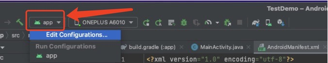
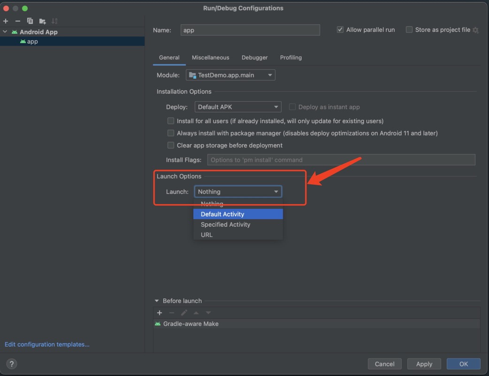

# Android Studio 安装APP后不自启动问题

开发新项目过程中突然碰到该问题，虽然对项目影响不大，但是在调试过程中非常不方便，没每次都需要再次点击APP才能启动，非常不方便。

1.点击Android Studio上的app的编辑配置Edit Configurations（如下图）

2.在General中选择Launch Options,启动项选择Default Activity（如下图）

3.点击Apply，最后点击OK。问题解决