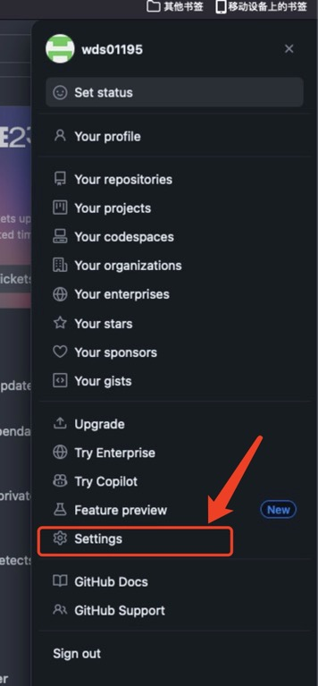
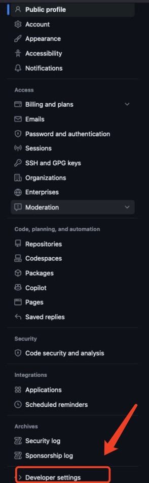
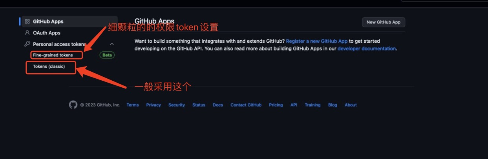
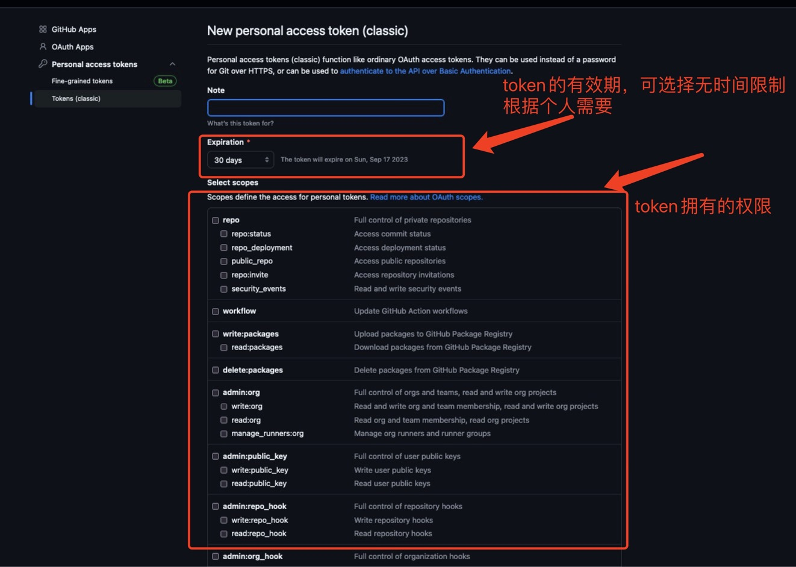
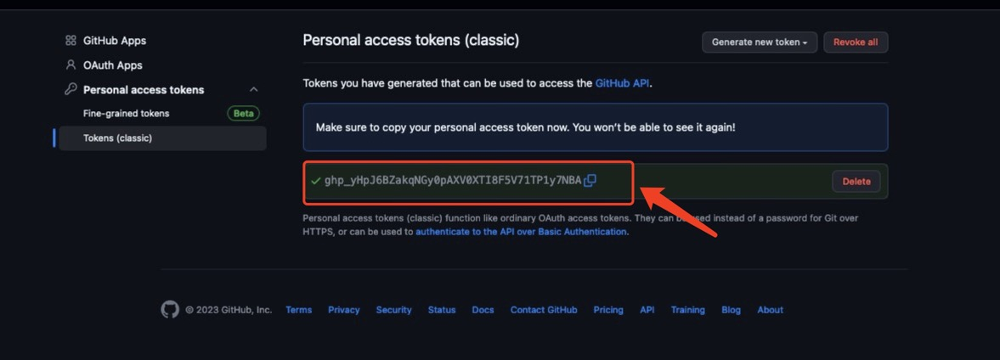

# github token个人令牌

很久没有使用github进行更新项目，写了一些项目登录github，push的时候发现了如下的问题。

##### remote: Support for password authentication was removed on August 13, 2021.（自从21年8月13后不再支持用户名密码的方式验证了，需要创建个人访问令牌(personal access token)。）
##### remote: Please see https://docs.github.com/en/get-started/getting-started-with-git/about-remote-repositories#cloning-with-https-urls for information on currently recommended modes of authentication.

解决方案如下：

#### 生成令牌

首先生成一个令牌，官方提供了[生成令牌的API文档](https://docs.github.com/en/authentication/keeping-your-account-and-data-secure/managing-your-personal-access-tokens)。

#### 问题解决的具体步骤如下：

##### 1、点击用户图像,点击Settings

##### 2.点击Settings页面中左侧的Developer Settings

##### 3.点击Personal access tokens->Tokens (classic)

##### 4.点击Generate new token，设置Token信息

点击Generate token生成令牌

##### 5.得到生成的令牌

记得拷贝下来，接下来都会用到.(下次访问Token页面无法拷贝，只能修改和删除才能再次copy Token)

### 如何使用：

#### 方式-：

**使用账户和Token的方式对项目进行push或者pull等登录操作。 输入passwd时使用Token。**

#### 方式二：

**把Token直接添加远程连接中，避免项目每次输入Token信息**

git remote set-url origin  https://<your_token>@github.com/<user_name>/<repo_name>.git

其他的操作和上述的基本上一致，只需要添加Token即可，例如clone新项目：git clone https://<your_token>@github.com/<user_name>/<repo_name>.git

