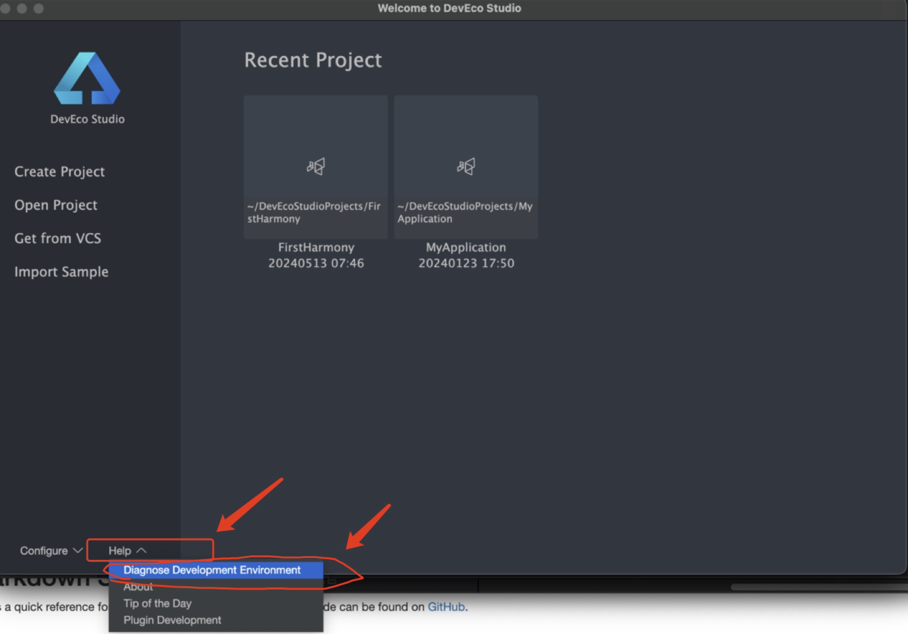
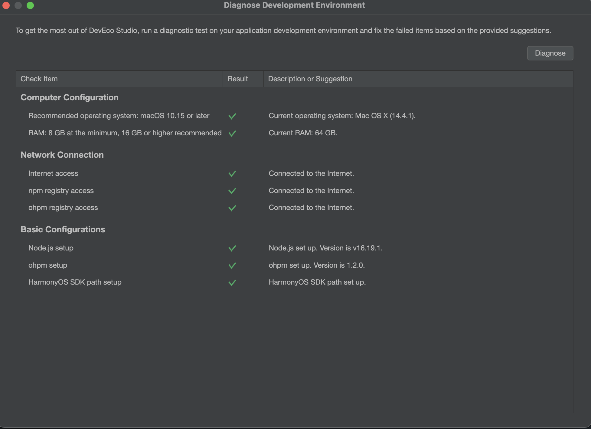

## HDC的配置和使用

### 简介

hdc（HarmonyOS Device Connector）是HarmonyOS为开发人员提供的用于调试的命令行工具，hdc和Android Studio上的ADB工具相似，通过该工具可以在windows/linux/mac系统上与真实设备或者模拟器进行交互。

### 环境准备

通过DevEco查看环境配置是否有问题





hdc准备安装前，开发工具和环境都已经配置好了。（**其中网上有一些说法是：下载hdc安装包的方式，但是我尝试了很多次，安装包一直没找到。不推荐**），hdc工具通过HarmonyOS SDK获取，存放于SDK的toolchains目录下，使用时将SDK的toolchains目录添加到环境变量。（其中SDK下有选择hmscore目录下的toolchains）。


Windows环境变量设置方法：
在此电脑 > 属性 > 高级系统设置 > 高级 > 环境变量中，添加HDC端口变量名为：HDC_SERVER_PORT，变量值可设置为任意未被占用的端口，如7035。


macOS环境变量设置方法：（不同电脑有所差异：~/.bash_profile 或者 ~/.zshrc）

输入以下内容，添加HDC_SERVER_PORT端口信息。

```bash
# 在系统的配置文件.bash_profile 增加
export HDC_SERVER_PORT=7035


# 执行如下命令让配置生效
source ~/.bash_profile
```

环境变量配置完成后，关闭并重启DevEco Studio。


