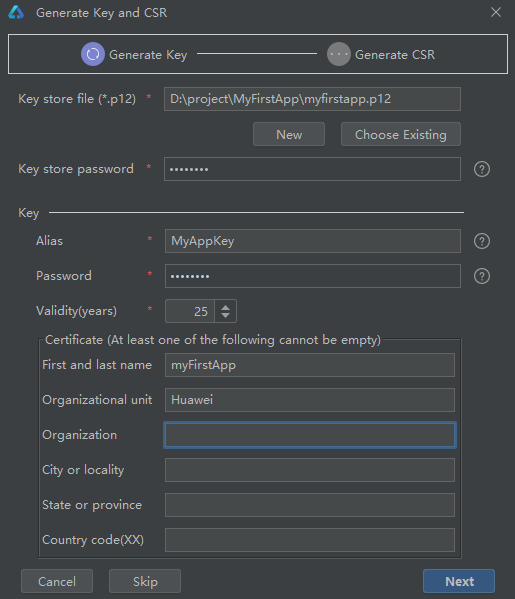
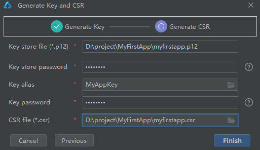
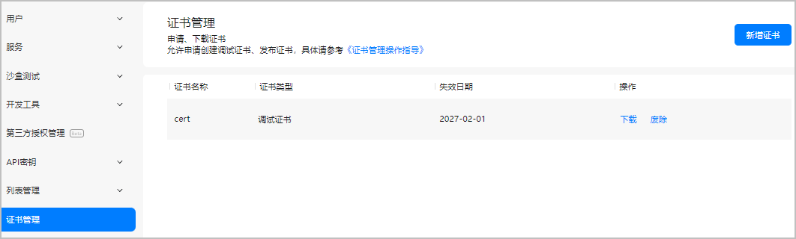
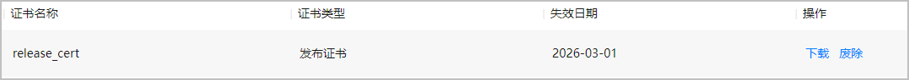
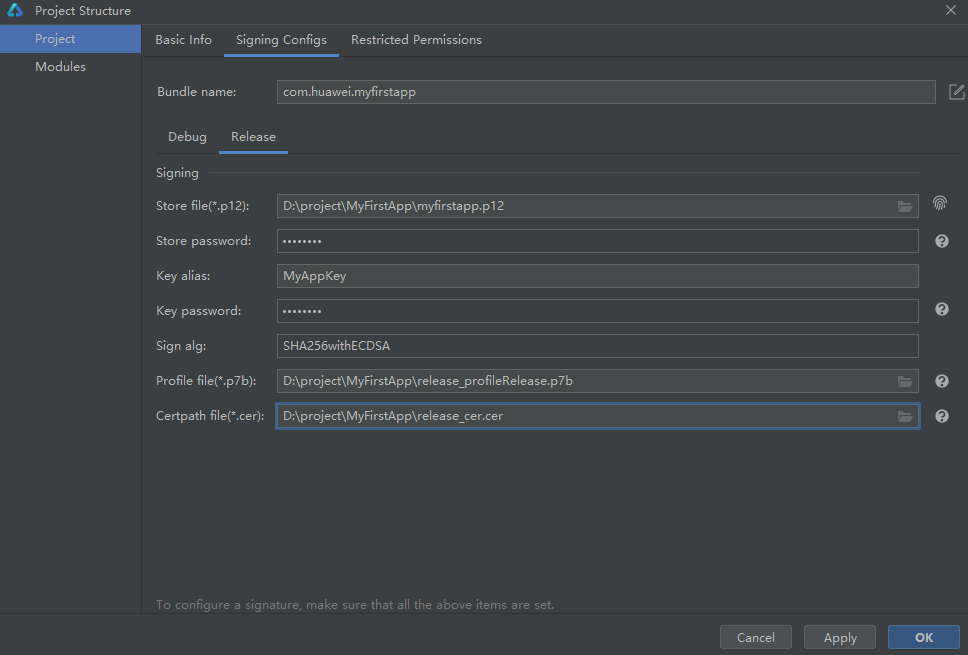
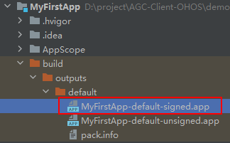
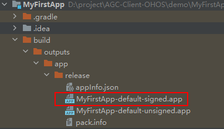

# Harmony 证书配置

HarmonyOS通过数字证书（.cer文件）和Profile文件（.p7b文件）等签名信息来保证元服务的完整性，元服务如需上架则必须通过签名校验。因此，您需要使用发布证书和Profile文件对元服务进行签名后才能发布。

## 生成密钥和证书请求文件

在申请数字证书和Profile文件前，首先需要通过DevEco Studio来生成密钥和证书请求文件。

密钥：包含非对称加密中使用的公钥和私钥，存储在密钥库文件中，格式为.p12，公钥和私钥对用于数字签名和验证。
证书请求文件：格式为.csr，全称为Certificate Signing Request，包含密钥对中的公钥和公共名称、组织名称、组织单位等信息，用于向AGC申请数字证书。

### 1.在顶部菜单栏选择“Build > Generate Key and CSR”。

### 2.Key Store File可以点击“Choose Existing”选择已有的密钥库文件（存储有密钥的.p12文件），跳转至步骤4继续配置；如果没有密钥库文件，点击“New”，跳转至步骤3进行创建。

### 3.在“Create Key Store”界面，填写密钥库信息后，点击“OK”。

##### Key store file：设置密钥库文件存储路径，并填写p12文件名。
##### Password：设置密钥库密码，必须由大写字母、小写字母、数字和特殊符号中的两种以上字符的组合，长度至少为8位。请记住该密码，后续签名配置需要使用。
##### Confirm password：再次输入密钥库密码。

### 4.在“Generate Key and CSR”界面继续填写密钥信息后，点击“Next”。

##### Alias：密钥的别名信息，用于标识密钥名称。请记住该别名，后续签名配置需要使用。
##### Password：密钥对应的密码，与密钥库密码保持一致，无需手动输入。
##### Validity：证书有效期，建议设置为25年及以上，覆盖应用/元服务的完整生命周期。
##### Certificate：输入证书基本信息，如组织、城市或地区、国家码等。

crs生成图：

5.在“Generate Key and CSR”界面设置CSR文件存储路径和CSR文件名，点击“Finish”。

【Generate Key and CSR 生成图】

CSR文件创建成功后，将在存储路径下获取生成密钥库文件（.p12）和证书请求文件（.csr）。

生成的文件

## 申请发布证书

发布证书是由AGC颁发的、为元服务配置签名信息的数字证书，可保障软件代码完整性和发布者身份真实性。证书格式为.cer，包含公钥、证书指纹等信息。

### 1.登录AppGallery Connect，选择“用户与访问”。

### 2.在左侧导航栏点击“证书管理”，进入“证书管理”页面，点击“新增证书”。

### 3.在弹出的“新增证书”窗口填写要申请的证书信息，点击“提交”。

### 4.证书申请成功后，“证书管理”页面展示证书名称等信息。点击“下载”，将生成的证书保存至本地，供后续签名使用。

## 申请发布Profile

### 前提条件 

您已在AGC创建HarmonyOS应用。

### 操作步骤
发布Profile格式为.p7b，包含HarmonyOS应用的包名、数字证书信息、应用允许申请的证书权限列表，以及允许应用调试的设备列表（如果应用类型为Release类型，则设备列表为空）等内容。每个应用包中必须包含一个Profile文件。

#### 1.登录AppGallery Connect，选择“我的项目”。
#### 2.找到您的项目，点击您创建的HarmonyOS应用。
#### 3.在左侧导航栏选择“HarmonyOS应用 > HAP Provision Profile管理”，进入“管理HAP Provision Profile”页面，点击右上角“添加”。

#### 4.在弹出的“HarmonyAppProvision信息”窗口中添加Profile，完成后点击“提交”。

#### 5.发布Profile申请成功后，“管理HAP Provision Profile”页面展示Profile名称、类型等信息。点击“下载”，将生成的Profile保存至本地，供后续签名使用。

### 配置签名信息

使用制作的私钥（.p12）文件、在AGC申请的证书文件和Profile（.p7b）文件，在DevEco Studio配置工程的签名信息，以构建携带发布签名信息的APP。

#### 1.打开DevEco Studio，在顶部菜单栏选择“File > Project Structure”，进入“Project Structure”界面。
#### 2.导航选择“Project”，点击“Signing Configs”页签，取消“Automatically generate signature”勾选项，然后配置工程的签名信息，完成后点击“OK”。

Store file：密钥库文件，选择生成密钥和证书请求文件时生成的.p12文件。
Store password：密钥库密码，需要与生成密钥和证书请求文件时设置的密钥库密码保持一致。
Key alias：密钥的别名信息，需要与生成密钥和证书请求文件设置的别名保持一致。
Key password：密钥的密码，需要与生成密钥和证书请求文件时设置的密码保持一致。
Sign alg：固定设置为“SHA256withECDSA”。
Profile file：选择申请发布Profile时下载的.p7b文件。
Certpath file：选择申请发布证书时下载的.cer文件。

若是API Version 4至7的工程，请在“Signing Configs”界面选择“Release”页签，然后再配置签名信息。

### 编译打包应用

#### 操作步骤

打开DevEco Studio，在顶部菜单栏选择“Build > Build Hap(s)/APP(s) > Build APP(s)”。
等待编译构建。编译完成后，将在工程目录“build > outputs > default”目录下，获取可用于发布的应用包。

API Version 4至7的工程需在“build > outputs > app > release”目录下获取。

