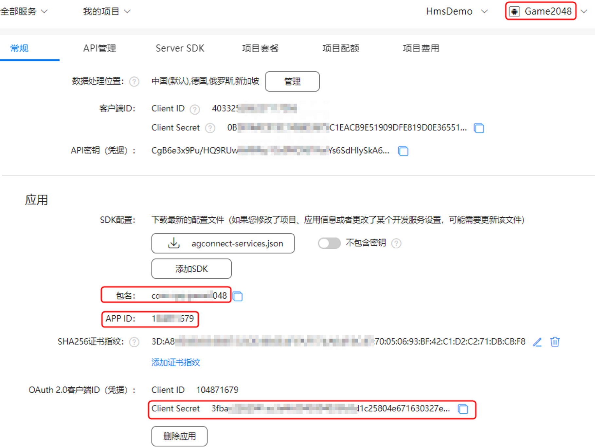
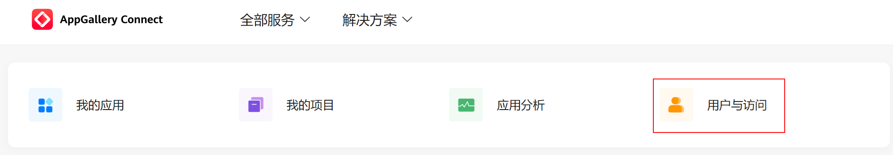
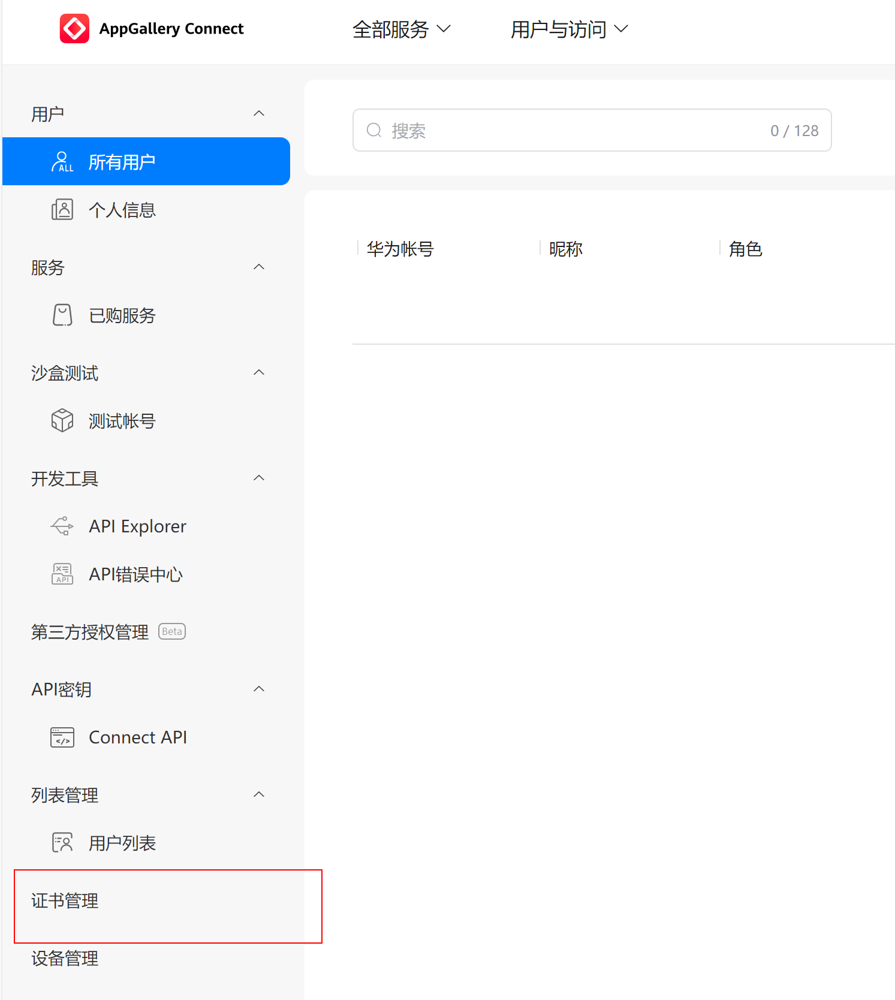
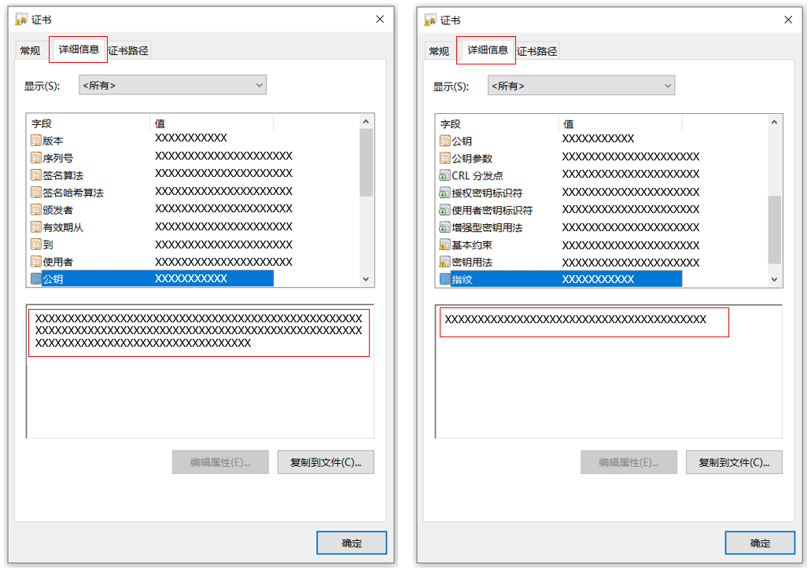
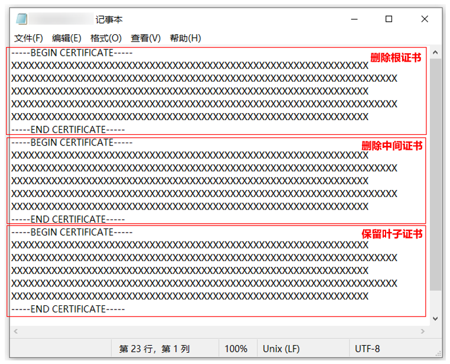

## HarmonyOS备案获取公钥和指纹

Harmony证书签名和Android差异挺大的，但是有点像IOS获取签名信息（一些方式和理念）。需要开发Harmony App还是需要深入了解如何获取备案获取公钥和指纹。


以HarmonyOS应用在华为云备案为例，需要填写对应的公钥和签名MD5值。

## 获取APP特征信息（鸿蒙应用）


#### 1. 登录AppGallery Connect网站，选择“我的项目”。

#### 2. 选择需要查询的应用。

#### 3. 获取包名。在“应用”信息下，页面中的“APP ID”即为应用ID，“包名”即为应用包名。

图1 获取鸿蒙包名




#### 4. 获取公钥和MD5。点击“用户与访问”，在页面左侧点击“证书管理”，下载需要备案的鸿蒙应用开发者证书；

图2 用户与访问



图3 证书管理




#### 5. 使用文本编辑器（如，记事本）打开已下载的证书，按照图示内容删除根证书和中间证书，保留叶子证书后，点击保存；

图4 编辑证书 （window上查看）



在Mac系统下双击安装证书，在证书管理系统（Keychain Access）选择查看详情也可以获取公钥等信息


#### 6. 打开已保存的证书，点击“详细信息-公钥”，获取APP的公钥信息；点击“详细信息-指纹”，获取APP的MD5签名信息。

图5 获取鸿蒙公钥、MD5（指纹）




### 备注：

通过上述可以获取App备案需要的相关公钥和指纹信息。如果确实需要获取MD5指纹，那可以通过openssl命令获取。

```bash
openssl x509 -fingerprint -md5 -noout -in myapp.cer

# md5 Fingerprint=55:9F:F7:FA:4A:0E:**:**:9E:E5:59:C9:9A:3A:08:8E

```

当然SHA1指纹也可以通过命令获取：

````bash

openssl x509 -fingerprint -sha1 -noout -in myapp.cer

 # sha1 Fingerprint=15:3E:C8:9D:A7:0E:**:**:**:59:DF:46:F1:53:AF:84:C9:BF:D0:61 

```

