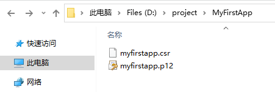
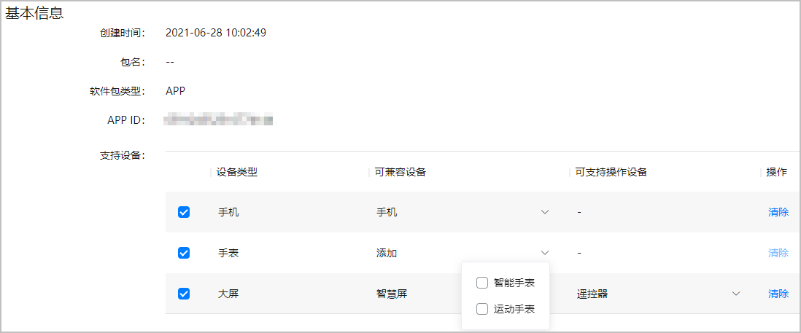
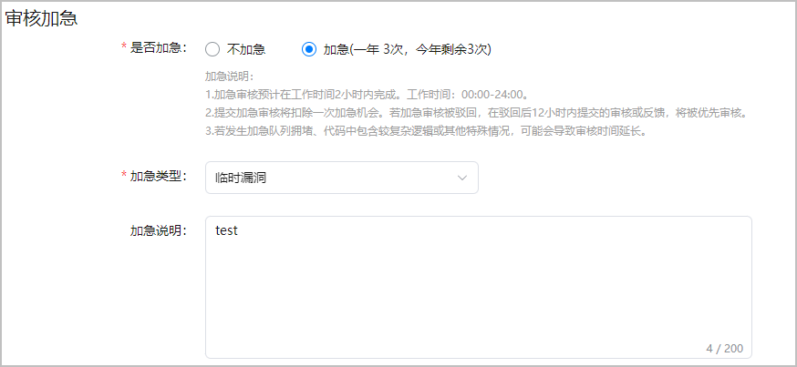

## 发布HarmonyOS应用

HarmonyOS通过数字证书（.cer文件）和Profile文件（.p7b文件）等签名信息来保证元服务的完整性，元服务如需上架则必须通过签名校验。因此，您需要使用发布证书和Profile文件对元服务进行签名后才能发布。

## 操作流程

## 生成密钥和证书请求文件

在申请数字证书和Profile文件前，首先需要通过DevEco Studio来生成密钥和证书请求文件。

密钥：包含非对称加密中使用的公钥和私钥，存储在密钥库文件中，格式为.p12，公钥和私钥对用于数字签名和验证。
证书请求文件：格式为.csr，全称为Certificate Signing Request，包含密钥对中的公钥和公共名称、组织名称、组织单位等信息，用于向AGC申请数字证书。

### 1.在顶部菜单栏选择“Build > Generate Key and CSR”。

### 2.Key Store File可以点击“Choose Existing”选择已有的密钥库文件（存储有密钥的.p12文件），跳转至步骤4继续配置；如果没有密钥库文件，点击“New”，跳转至步骤3进行创建。

### 3.在“Create Key Store”界面，填写密钥库信息后，点击“OK”。

##### Key store file：设置密钥库文件存储路径，并填写p12文件名。
##### Password：设置密钥库密码，必须由大写字母、小写字母、数字和特殊符号中的两种以上字符的组合，长度至少为8位。请记住该密码，后续签名配置需要使用。
##### Confirm password：再次输入密钥库密码。

### 4.在“Generate Key and CSR”界面继续填写密钥信息后，点击“Next”。

##### Alias：密钥的别名信息，用于标识密钥名称。请记住该别名，后续签名配置需要使用。
##### Password：密钥对应的密码，与密钥库密码保持一致，无需手动输入。
##### Validity：证书有效期，建议设置为25年及以上，覆盖应用/元服务的完整生命周期。
##### Certificate：输入证书基本信息，如组织、城市或地区、国家码等。

crs生成图：

5.在“Generate Key and CSR”界面设置CSR文件存储路径和CSR文件名，点击“Finish”。

【Generate Key and CSR 生成图】

CSR文件创建成功后，将在存储路径下获取生成密钥库文件（.p12）和证书请求文件（.csr）。

生成的文件

## 申请发布证书

发布证书是由AGC颁发的、为元服务配置签名信息的数字证书，可保障软件代码完整性和发布者身份真实性。证书格式为.cer，包含公钥、证书指纹等信息。

### 1.登录AppGallery Connect，选择“用户与访问”。

### 2.在左侧导航栏点击“证书管理”，进入“证书管理”页面，点击“新增证书”。

### 3.在弹出的“新增证书”窗口填写要申请的证书信息，点击“提交”。

### 4.证书申请成功后，“证书管理”页面展示证书名称等信息。点击“下载”，将生成的证书保存至本地，供后续签名使用。

## 申请发布Profile

### 前提条件 

您已在AGC创建HarmonyOS应用。

### 操作步骤
发布Profile格式为.p7b，包含HarmonyOS应用的包名、数字证书信息、应用允许申请的证书权限列表，以及允许应用调试的设备列表（如果应用类型为Release类型，则设备列表为空）等内容。每个应用包中必须包含一个Profile文件。

#### 1.登录AppGallery Connect，选择“我的项目”。
#### 2.找到您的项目，点击您创建的HarmonyOS应用。
#### 3.在左侧导航栏选择“HarmonyOS应用 > HAP Provision Profile管理”，进入“管理HAP Provision Profile”页面，点击右上角“添加”。

#### 4.在弹出的“HarmonyAppProvision信息”窗口中添加Profile，完成后点击“提交”。

#### 5.发布Profile申请成功后，“管理HAP Provision Profile”页面展示Profile名称、类型等信息。点击“下载”，将生成的Profile保存至本地，供后续签名使用。

### 配置签名信息

使用制作的私钥（.p12）文件、在AGC申请的证书文件和Profile（.p7b）文件，在DevEco Studio配置工程的签名信息，以构建携带发布签名信息的APP。

#### 1.打开DevEco Studio，在顶部菜单栏选择“File > Project Structure”，进入“Project Structure”界面。
#### 2.导航选择“Project”，点击“Signing Configs”页签，取消“Automatically generate signature”勾选项，然后配置工程的签名信息，完成后点击“OK”。

Store file：密钥库文件，选择生成密钥和证书请求文件时生成的.p12文件。
Store password：密钥库密码，需要与生成密钥和证书请求文件时设置的密钥库密码保持一致。
Key alias：密钥的别名信息，需要与生成密钥和证书请求文件设置的别名保持一致。
Key password：密钥的密码，需要与生成密钥和证书请求文件时设置的密码保持一致。
Sign alg：固定设置为“SHA256withECDSA”。
Profile file：选择申请发布Profile时下载的.p7b文件。
Certpath file：选择申请发布证书时下载的.cer文件。

若是API Version 4至7的工程，请在“Signing Configs”界面选择“Release”页签，然后再配置签名信息。

### 编译打包应用

#### 操作步骤

打开DevEco Studio，在顶部菜单栏选择“Build > Build Hap(s)/APP(s) > Build APP(s)”。
等待编译构建。编译完成后，将在工程目录“build > outputs > default”目录下，获取可用于发布的应用包。

API Version 4至7的工程需在“build > outputs > app > release”目录下获取。

## 上架HarmonyOS应用

获取到HarmonyOS应用软件包后，您可将应用提交至AGC申请上架。上架成功后，用户即可在华为应用市场搜索获取您的HarmonyOS应用。

### 配置应用信息
#### 1.登录AppGallery Connect，选择“我的应用”。
#### 12.在应用列表首页中选择“HarmonyOS”页签，点击待发布的HarmonyOS应用名称。

如应用较多，可点击“类型”下拉框仅筛选出HarmonyOS应用，或点击“支持设备”按设备类型筛选查找。

#### 13.在左侧导航栏选择“应用信息”菜单。
如果您尚未签署华为智慧分发平台合作协议，此时会弹出华为智慧分发平台合作协议对话框，您需按提示进行协议签署。否则，页面将跳转回AGC首页，您将无法继续发布HarmonyOS应用。

#### 14.在“基本信息”区域，您可以配置HarmonyOS应用支持的设备信息。

#### 15.在“可本地化基础信息”区域，配置HarmonyOS应用发布后向用户呈现的信息，具体请参见配置可本地化基础信息。
#### 16.根据HarmonyOS应用提供的功能和内容，在“应用分类”区域选择应用归属的类别，具体请参见设置应用分类。
#### 17.配置HarmonyOS应用的“开发者服务信息”，详情请参见配置开发者服务信息。
#### 18.配置完成后点击“下一步”，在弹窗中点击“确认”，进入“准备提交”页面，开始设置版本信息。

### 配置版本信息
#### 11.配置HarmonyOS应用的“发布国家或地区”，详情请参见设置发布国家或地区。
#### 2.设置是否为开放式测试版本: **如您想发布为开放式测试版本，选择“是”，具体配置请参见开放式测试操作指南。正式发布的版本请选择“否”**

#### 3.在“软件版本”下点击“软件包管理”后，在弹窗中点击“上传”。

#### 4.在“上传包”窗口中点击“+”，上传应用的软件包。上传成功后，您可在“软件包管理”窗口中执行如下操作：
点击文件名称下，查看软件包详细信息，如包名、SHA256、软件大小。请确认软件包信息与您需要发布的版本一致。
点击“操作”栏的“调试”或“测试”链接，对软件包分别进行云调试或云测试，可及早发现并解决问题，提高应用审核通过率。具体操作请参考云测试和云调试操作指南。
点击“操作”栏的“删除”，可删除不需要的软件包。仅允许删除与草稿态版本关联的软件包。

#### 5.配置“审核加急”。
是否加急：配置为“不加急”，您的应用将按照正常的流程进行审核上架。配置为“加急”，系统会优先处理该应用的上架审核任务。若您的应用符合上架条件，将在2小时之内完成上架，同时会扣除一次加急机会。若您的应用被审核驳回，在驳回后的12小时内提交的审核或反馈，将被优先审核，被驳回的情况下不会扣除加急机会。
加急类型：当前加急类型包括临时漏洞、临时活动、其他。若配置为“临时漏洞”，则表示您需要紧急修复缺陷；配置为“临时活动”表示正在进行一项商业类活动。
加急说明：您可在此对加急审核上架进行描述，以便运营人员快速处理审核任务。

#### 6.配置HarmonyOS应用的“付费情况”，具体请参见设置应用付费情况。
#### 7.选择应用内资费类型，即用户在使用应用过程中的付费类型，如因使用道具、开通会员等进行的付费。支持多选。

#### 8.在“内容分级”区域，点击“设置”，按实际情况填写调查问卷，填写完成将获取当前应用的年龄分级结果。具体请参见设置内容分级。
如果涉及以下场景，请填写HarmonyOS应用的“应用隐私说明”，否则直接进行下一步。
如检测到应用软件包涉及获取敏感隐私权限，您需为每个敏感权限项填写相应的权限说明，每条权限说明最大支持500字符。

如检测到您的应用软件包涉及获取受限权限，您需为每个受限权限项填写相应的权限说明，并上传视频说明使用场景。
权限说明：每条权限说明最大支持500字符。
使用场景视频：支持MOV或MP4格式，大小500MB以内。仅支持上传一个视频。

如检测到您的应用软件包涉及获取ACL权限，您需为每个ACL权限项说明使用场景。

#### 9.使用场景视频：通过视频说明权限使用场景，支持MOV或MP4格式，大小500MB以内。
使用场景说明：可通过选择AGC提供的场景标签或者自定义文字来说明权限使用场景。自定义权限说明不得超过500字符。

#### 10.在“隐私声明”区域提供隐私声明链接。
隐私政策网址：该网站将供用户访问，从而了解服务是如何处理敏感的用户数据和设备数据。
#### 11.隐私权利：提供用户实施其权利的相关网站，例如：删除、修改、导出个人数据的入口。
根据应用是否收集用户的信息数据选择是否在华为应用市场的应用详情页展示隐私标签，告知用户您的应用如何使用个人数据，具体请参见录入隐私标签信息。

#### 12.在“版权信息”区域上传发布HarmonyOS应用所需的资质材料。

#### 13.根据《工业和信息化部关于开展移动互联网应用程序备案工作的通知》，自2023年9月初起，在中国大陆地区提供互联网信息服务的APP开发者，需要依法履行APP备案手续，并通过APP分发平台的备案信息核验。点击一图读懂APP备案，可了解APP备案的流程与要求。

#### 14.在“应用审核信息”栏，填写审核相关的信息。该部分信息仅会展示给审核人员查看。您可在“备注”栏填写对审核过程会有所帮助的、有关您服务的额外信息，包括在测试中需要的特别设置等。如审核过程涉及身份验证，还需提供测试帐号供华为审核人员完成服务中登录、查看、购买等功能的审核

#### 15.配置上架时间。您可以选择“审核通过立即上架”，也可以选择“指定时间”。

#### 16.点击“提交审核”，在弹出的窗口中确认版本号无误后，点击“确认”。
#### 17.提交成功后，在“版本信息”页面“状态”中可查看审核状态。

#### 18.对于配置为“指定时间”上架的应用，审核通过之后、指定上架时间到达之前，您可随时手动发布版本上线：在版本信息页面右上角点击“手动发布”，在确认提示框点击“确认”即可。手动发布一般在几分钟内生效

