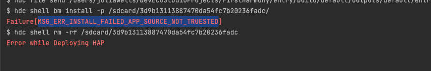
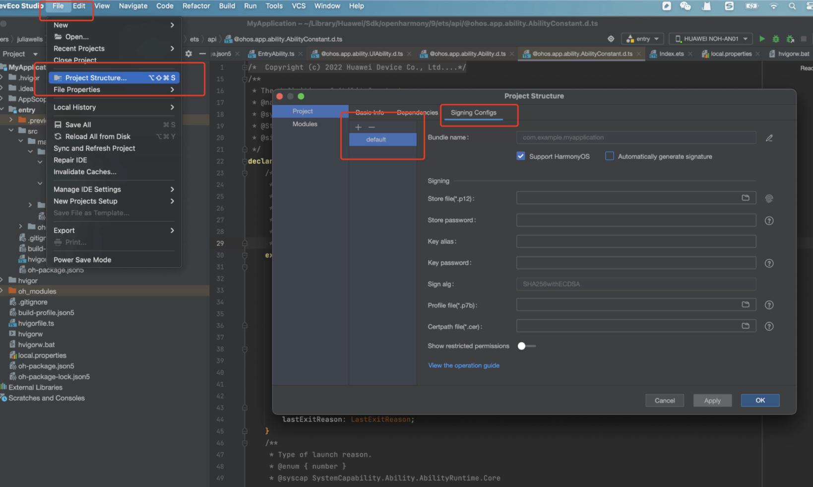
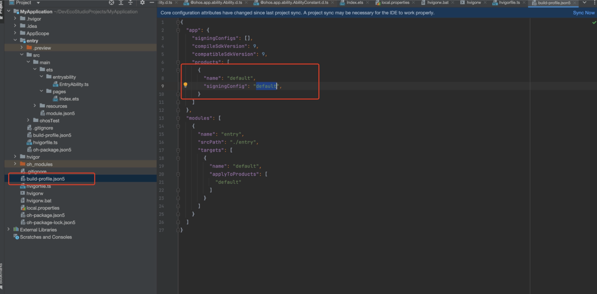

## 鸿蒙HarmonyOS应用真机调试Failure[MSG_ERR_INSTALL_FAILED_APP_SOURCE_NOT_TRUESTED]解决办法

鸿蒙HarmonyOS应用真机调试Failure[MSG_ERR_INSTALL_FAILED_APP_SOURCE_NOT_TRUESTED]

#### 原因：

签名问题导致的， 大概就是发布证书只能用于应用市场发布应用，不可以用于调试

### 一、创建一个新签名，点击 File -> Project Structure... -> Project -> Signing Configs 点击 + 新增一个签名

### 二、修改配置使用新签名吗，打开 build-profile.json5 -> products -> signingConfig 改成新的签名就行。

### 三、点击DevEco右上角运行 测试即可