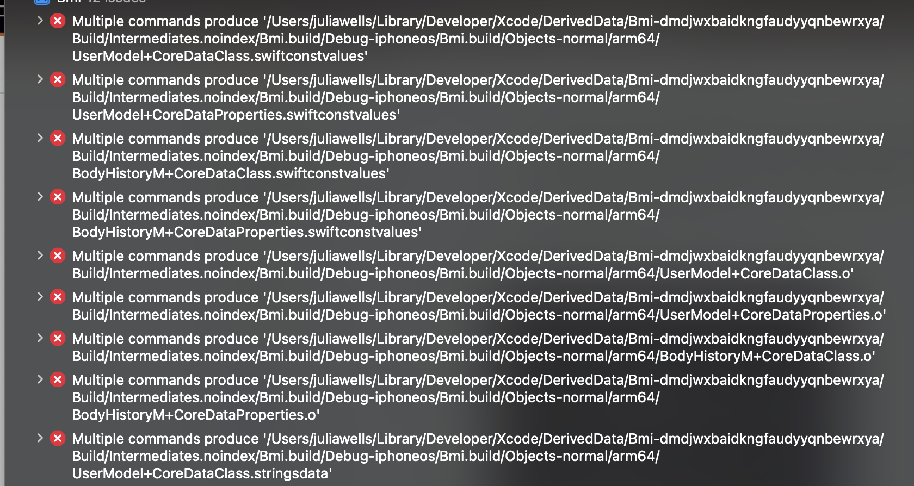
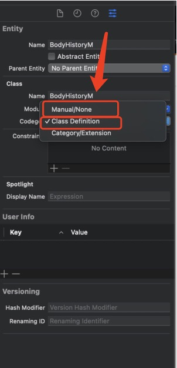
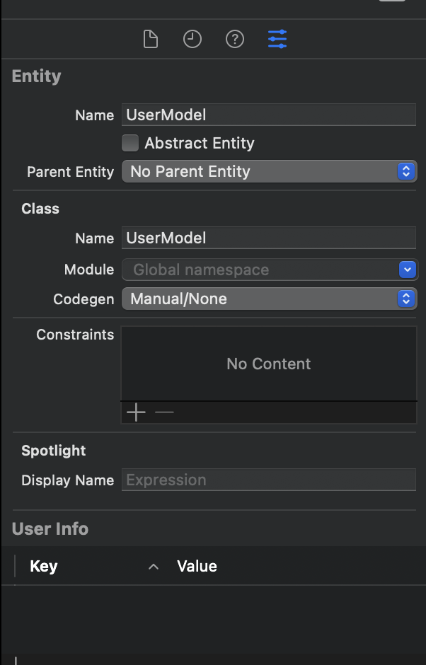

## How to fix error 'Multiple commands produce..' after generating Core Data subclasses

在使用CoreData过程中，自动生成Entity对应的类，会出现一下Multiple commands produce '/xxxx/DerivedData/Bmi-dmdjwxbaidkngfaudyyqnbewrxya/Build/Intermediates.noindex/Bmi.build/Debug-iphonesimulator/Bmi.build/Objects-normal/arm64/UserModel+CoreDataClass.swiftconstvalues'(Multiple commands produce..' after generating Core Data subclasses)的问题。

### 解决方法：

修改Entity的属性Codegen，从原来的Class Definition或者是Category/Extension 设置成 Manual/None

原来：

修改后：

Clean一下，build就不报错了

