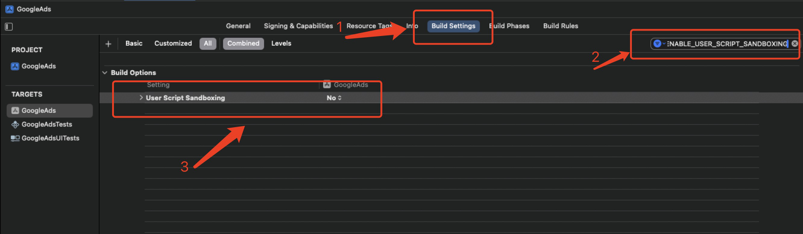

# Sandbox: bash(76843) deny(1) file-write-data /Users/XXX/ios/Pods/resources-to-copy-XXX.txt

在开发过程中，一些老项目进行更新是突然发现Sandbox: bash(76843) deny(1) file-write-data /Users/XXX/ios/Pods/resources-to-copy-XXX.txt的错误，查了一些资料说需要设置ENABLE_USER_SCRIPT_SANDBOXING就可以解决了

解决方法如下:(ENABLE_USER_SCRIPT_SANDBOXING 设置为No)

### 详解ENABLE_USER_SCRIPT_SANDBOXING具体

在 iOS 项目中，ENABLE_USER_SCRIPT_SANDBOXING 是一个构建设置选项，用于启用或禁用用户脚本沙箱（User Script Sandboxing）功能

当 ENABLE_USER_SCRIPT_SANDBOXING 设置为 YES 时，应用程序将为每个用户脚本创建一个单独的沙箱环境。这意味着用户脚本将在一个受限制的环境中运行，无法访问应用程序的内部数据和资源。这有助于提高应用程序的安全性，防止恶意脚本对应用程序造成损害。

如果将 ENABLE_USER_SCRIPT_SANDBOXING 设置为 NO，则用户脚本将在与应用程序相同的环境中运行，可以访问应用程序的内部数据和资源。这可能会导致安全风险，因为恶意脚本可能会窃取敏感数据或破坏应用程序的功能。