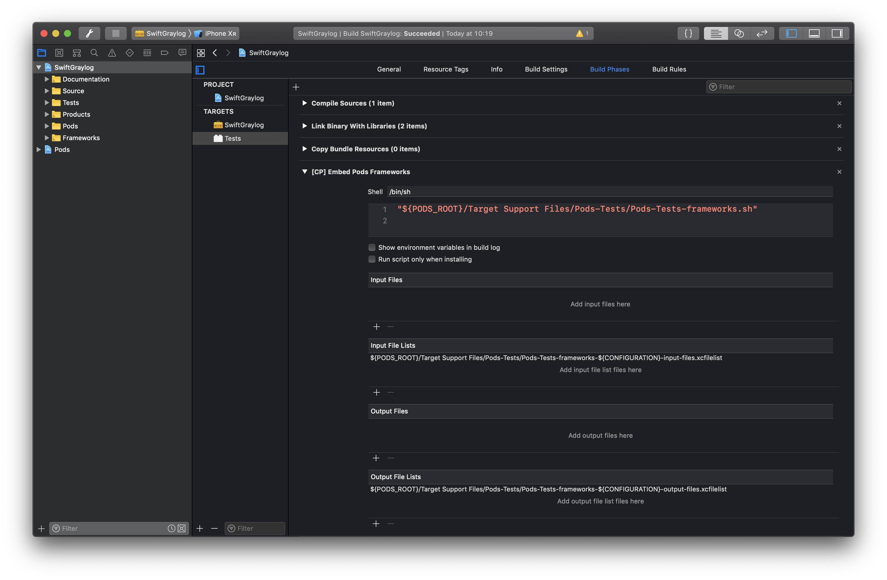
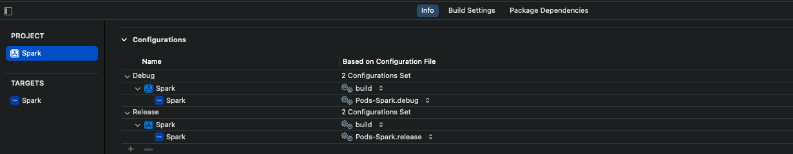

## Unable to load contents of file list: input/output xcfilelist

开发过程中升级和更新Pods的过程中，出现如下的报错问题


Unable to load contents of file list: '/Target Support Files/Pods-xxx/Pods-xxx-frameworks-Debug-input-files.xcfilelist'


查看了很多方案：

最常见的推荐方案：
#### 方案一：

```bash
sudo gem update cocoapods --pre
pod update
clean
build

```


#### 方案二：

移除配置中的 Input Files Lists 和 Output Files Lists。



但是运行之后会出现需要Pod install（The sandbox is not in sync with the Podfile.lock. Run 'pod install' or update your CocoaPods installation.）


#### 方案三：
Podfile.lock和Manifest.lock保证一直（删除Manifest.lock中内容，复制Podfile.lock到Manifest.lock中）。


## 解决方案 (最终方案)

Go to Xcode > Project > Info > Configurations

Set the values for Debug > Pods-XXX.debug and Release = Pods-XXX.release

