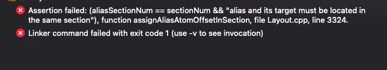
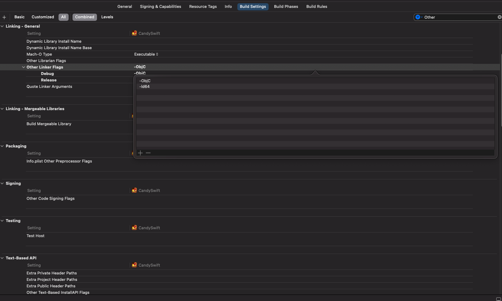

# iOS17及Xcode15 Assertion failed: (aliasSectionNum == sectionNum && "alias and its target must be located in the same section")

把一些老项目重新运行时，会经常遇到各种各样的问题，其中Assertion failed: (aliasSectionNum == sectionNum && "alias and its target must be located in the same section"), function assignAliasAtomOffsetInSection, file Layout.cpp, line 3324. 或者是 Assertion failed: (aliasSectionNum == sectionNum && "alias and its target must be located in the same section"), function assignAliasAtomOffsetInSection, file Layout.cpp, line 3248.就是其中的一个报错。

**报错问题如图所示**

**解决方案：Build Settings -> Other Linker Flags 中增加 -ld64**

如图所示：

