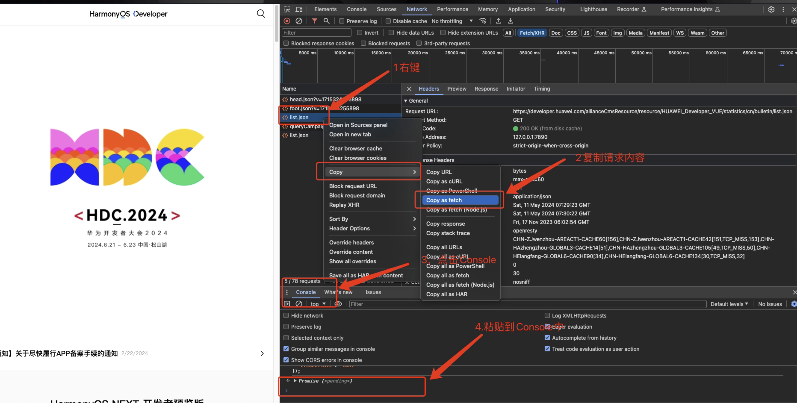
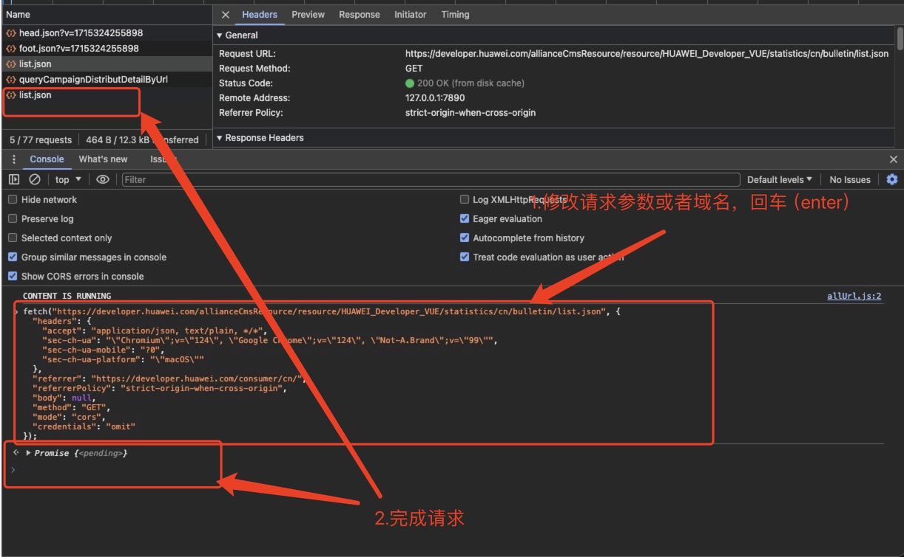

# 如何在Chrome浏览器中模拟请求或修改请求的域名(参数等)

开发过程中，经常会遇到联调。接口发布到测试环境（正式环境），每次都需要写接口进行本地调试比较麻烦，所有使用Chrome直接调试就变得非常便利。

在需要调试的页面，使用F12打开Chrome调试模式。在请求路径上右键。然后选择Copy->Copy as fetch, 然后打开Console，粘贴当前请求的内容，回车发送请求（在Console中粘贴后请求内容，可以直接修改域名或者参数）

备注：

1.Console中粘贴会出无法粘贴的现象，可以参考博客 “[解决谷歌浏览器，Console控制台无法粘贴代码方法](https://skyerkj.com/blog/other/2024051132132102.html)”这篇文章

2.修改域名的时候可能会出现跨域的问题，可以新打开一个窗口（浏览器输入修改后的域名）。把Copy的内容粘贴到Console中，就可以解决跨域的问题

